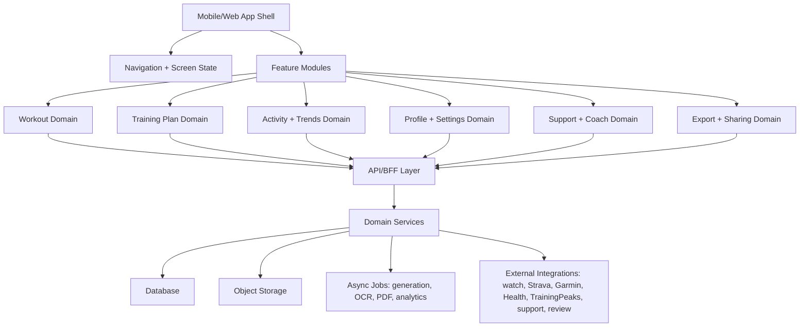
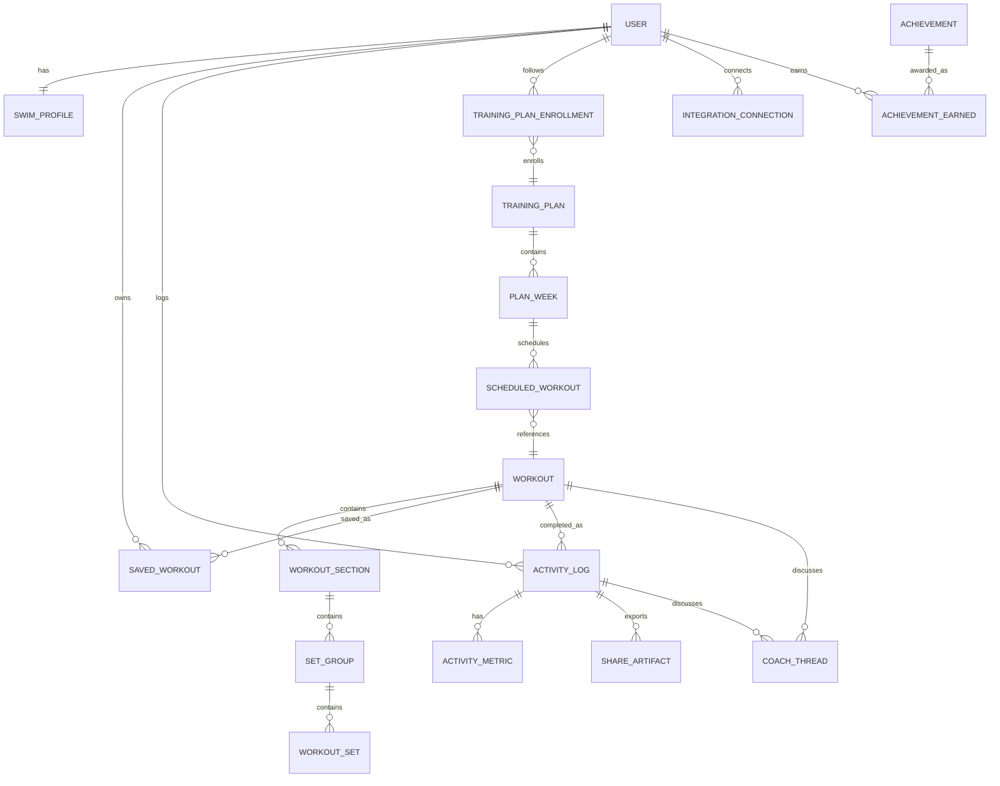

# Swim Training App Architecture

Source reference: `manual-navigation-map/NAVIGATION.md`

This architecture mirrors the mapped MySwimPro product surface at a practical planning level. It is intended as a backbone for PRDs and agent development specifications, not as a low-level implementation design.

## Product Shape

The app is a swim training companion with four primary tabs:

- Home: current training context, next workout, active plan, today's logged workout, quick creation actions, and support entry.
- Library: saved workouts, workout creation/import/generation, workout of the day history, training plan catalog, workout category browsing, and support entry.
- Trends: monthly performance/statistics dashboard and support entry.
- Profile: user performance, history, swim profile preferences, achievements, settings, support, and account/device/privacy/legal flows.

Most deeper screens reuse a small number of shared feature surfaces:

- Workout detail
- Workout start menu
- Splash Mode active workout player
- Manual workout log
- Workout PDF export/share
- Coach Chat
- Training plan detail
- Native share/photo/camera/legal/support leaves

## High-Level System Architecture

Recommended shape:

- App Shell: authenticated app container with bottom tabs, top bars, modal/sheet host, native-intent bridge, and deep-link handling.
- API/BFF: one product-facing API layer that composes domain services for screens.
- Domain Services: separate business modules for workouts, plans, activity logs, profile, exports, integrations, support, and analytics.
- Async Jobs: anything slow or external, especially AI workout/plan generation, workout image import/OCR, PDF rendering, social-card rendering, metric recalculation, and watch sync.
- Event Stream: track important product events such as workout generated, plan started, workout logged, PDF exported, share opened, integration connected, and profile changed.

## Frontend Feature Modules

| Module | Responsibility | Main Screens |
| --- | --- | --- |
| App Shell | Authenticated navigation, bottom tabs, shared headers, modal/sheet routing, native bridge | Home, Library, Trends, Profile |
| Home | Personalized dashboard before and after an active plan/log | Home empty state, active-plan Home, post-log Home |
| Workout Builder | Generate, write, import, edit, save workouts | Generate wizard, custom workout editor, image import |
| Workout Library | Browse saved/category/WOD workouts | Saved workouts, WOD history, workout lists, filters |
| Workout Detail | Shared workout rendering and actions | Generated, saved, WOD, plan, category, completed workouts |
| Workout Execution | Start menu and active guided swim | Start menu, Splash Mode |
| Activity Logging | Manual log and completed workout detail/edit | Manual log, completed workout detail, completed edit |
| Training Plans | Plan generation, plan catalog, active plan detail | Plan wizard, plan list, template detail, active plan detail |
| Trends | Aggregate progress metrics | Monthly stats dashboard |
| Profile | History, performance, swim preferences, achievements | Profile tabs, achievements grid/detail |
| Settings | Account, devices, sharing, support, privacy, legal | Settings and sub-settings |
| Support | Intercom-like help center and coach messaging | Support root, collections, articles, Coach Chat |
| Export/Share | PDF and social image preview flows | PDF viewer, native share sheet, social preview |

## Route / Screen Inventory

### Root Navigation

- `/home`
- `/library`
- `/trends`
- `/profile`

### Home Routes

- `/home`
  - Empty/default Home with quick actions.
  - Active plan Home with next workout, `VIEW`, `SWAP`, training-plan card.
  - Post-log Home with streak confirmation and today's completed workout card.
- `/home/next-workout`
  - Opens shared Workout Detail for the active plan's next workout.
- `/home/swap-workout`
  - Opens Generate Workout flow in replacement mode.
- `/home/today-workout/:activityId`
  - Opens Completed Workout Detail.

### Workout Creation Routes

- `/workouts/generate`
  - Step 1: target distance.
  - Step 2: optional focus: Recovery, Sprint, Mid-distance, Long-distance.
  - Step 3: optional strokes: Freestyle, Backstroke, Breaststroke, Butterfly, IM, Kick.
  - Step 4: optional equipment: Paddles, Fins, Pull Buoy, Snorkel, Kickboard, Parachute.
  - Step 5: optional notes.
  - Result: shared Workout Detail.
- `/workouts/custom/new`
  - Custom workout editor with pool length, sections, set groups, set editor, group settings, add/delete controls.
- `/workouts/import-image`
  - Import choice screen.
  - Native photo library leaf.
  - Native camera leaf.

### Shared Workout Routes

- `/workouts/:workoutId`
  - Shared Workout Detail for generated, saved, WOD, category, plan, and custom workouts.
  - Common actions: Start Workout, More, Coach Chat, pool length controls, section expand/overflow.
- `/workouts/:workoutId/start`
  - Start menu with Start on this phone, Manual Log, Send to Watch, Open PDF, close.
- `/workouts/:workoutId/splash`
  - Landscape guided workout player.
- `/workouts/:workoutId/log`
  - Manual Log form.
- `/workouts/:workoutId/pdf`
  - PDF viewer and native share entry.
- `/workouts/:workoutId/coach-chat`
  - Coach Chat thread scoped to this workout.
- `/workouts/:workoutId/save-to-library`
  - Add to Library dialog.

### Library Routes

- `/library`
  - My Workout Library preview.
  - Create a Workout cards: Custom, Import, Generate.
  - Workout of the Day preview/history.
  - Explore Training Plans.
  - Explore Swim Workouts categories such as Freestyle and Distance.
- `/library/saved-workouts`
  - Saved workout list, item overflow, delete leaf.
- `/library/wod`
  - Workout of the Day history list.
- `/library/wod/:workoutId`
  - Shared Workout Detail.
- `/library/training-plans`
  - Plan catalog with Generate Personalized Plan and template plans.
- `/library/training-plans/:planId`
  - Template Plan Detail with Start Plan action.
- `/library/workouts/:category`
  - Workout category list, result count, filter.
- `/library/workouts/:category/filter`
  - Filter sheet with distance, duration, skill level, workout type.

### Training Plan Routes

- `/plans/generate`
  - Step 1: goal selection, for example Enhance Speed.
  - Step 2: plan length / pool distance.
  - Step 3: weekly workout count.
  - Step 4: swim days.
  - Step 5: weekly yardage / optional notes / generate.
- `/plans/:planId`
  - Active or template plan detail with overview, weekly volume, week workouts.
- `/plans/:planId/more`
  - Create New Plan and Cancel Plan.
- `/plans/:planId/workouts/:workoutId`
  - Shared Workout Detail for a plan workout.

### Trends Routes

- `/trends`
  - Monthly stat cards: total distance, total duration, average workout distance/duration, pace, SWOLF, and future metric cards.

### Profile Routes

- `/profile`
  - Tabs: History, Performance, Swim Profile.
- `/profile/history`
  - Lifetime counters, completed workouts, achievements preview.
- `/profile/performance`
  - Seed-time cards by stroke/distance.
- `/profile/swim-profile`
  - Editable swim preferences: seed times, swim days, preferred workout length.
- `/profile/achievements`
  - Achievement grid.
- `/profile/achievements/:achievementId`
  - Achievement detail.

### Settings Routes

- `/settings`
  - Account Settings, Devices & Integrations, Share App, Support, Send Logs, Write Review, Privacy, Terms.
- `/settings/account`
  - Email, edit name/picture, private activity, subscription management, logout.
- `/settings/devices`
  - Strava, Garmin, Health Connect, TrainingPeaks, authorization code entry.
- `/settings/privacy`
  - Tracking limit, privacy policy, download account data, delete account.
- `/settings/terms`
  - Legal WebView/external page.
- Native/external leaves:
  - App share sheet.
  - Store review prompt.
  - Subscription management.
  - Diagnostic log sending.

### Completed Workout Routes

- `/activities/:activityId`
  - Completed Workout Detail.
  - Actions: More, Edit, Coach Chat.
- `/activities/:activityId/edit`
  - Completed workout edit form.
- `/activities/:activityId/share`
  - In-app social share preview with visual customization.
- `/activities/:activityId/pdf`
  - Completed workout PDF export.

### Support Routes

- `/support`
  - Support root with Help, Messages, article cards, close.
- `/support/help`
  - Collection list.
- `/support/help/:collectionId`
  - Article or subcollection list.
- `/support/articles/:articleId`
  - Article detail.
- `/support/messages`
  - Messaging surface; sending messages is a final action.
- `/coach-chat/:scopeType/:scopeId`
  - Coach conversation scoped to workout or completed activity.

## Core Domain Model

The following model is intentionally compact. PRDs can expand fields per screen.

Key entities:

- User: account identity, membership status, settings.
- SwimProfile: seed times, preferred workout length, swim days, unit preferences, privacy settings.
- Workout: title, source, distance, duration, calories, pool length, level, category, strokes, equipment, sections.
- WorkoutSection: named section such as Warm Up, Main Set, Cool Down.
- SetGroup: repeat/group settings, round count, ordering.
- WorkoutSet: repetitions, distance, stroke, interval, intensity, description, media references.
- SavedWorkout: user-owned reference/copy of a workout.
- TrainingPlan: template or generated plan.
- TrainingPlanEnrollment: active plan state, start date, current week/day, completion status.
- ScheduledWorkout: plan workout assignment and date.
- ActivityLog: completed workout/logged swim with title, date, distance, duration, notes, sets, image, source.
- ActivityMetric: derived pace, SWOLF, calories, streak contributions.
- Achievement: badge metadata and unlock criteria.
- IntegrationConnection: Strava/Garmin/Health/TrainingPeaks state and tokens.
- ShareArtifact: PDF/social image export metadata.
- CoachThread: messages tied to workout or activity context.
- SupportArticle: help content collection/article metadata if support is first-party.

## Backend Services

| Service | Responsibilities |
| --- | --- |
| Auth/Account Service | Session, user identity, membership, logout, account deletion workflow, subscription handoff |
| Profile Service | Swim profile, seed times, privacy flags, preferred swim days, profile image/name |
| Workout Catalog Service | Category browsing, WOD, saved workouts, filters, workout detail retrieval |
| Workout Builder Service | Custom workout draft, section/set/group editing, save to library |
| Workout Generator Service | AI/rules-based generation from distance, focus, strokes, equipment, notes |
| Image Import Service | Camera/photo intake, OCR/extraction, workout normalization |
| Session Service | Splash Mode state, active set, timer/progress, pause/finish hooks |
| Activity Log Service | Manual log, completed workout detail, edit, delete, post-log home state |
| Training Plan Service | Plan catalog, generated plan wizard, active plan enrollment, swap next workout |
| Trends Service | Monthly/lifetime aggregation, pace/SWOLF/duration/distance cards |
| Achievement Service | Badge catalog, unlock criteria, earned progress |
| Export Service | Workout PDFs, completed-workout PDFs, social share images |
| Share Service | Native share handoff, share metadata, non-transmission-safe preview state |
| Device Integration Service | Watch send, Strava, Garmin, Health Connect, TrainingPeaks, authorization code |
| Coach Service | Coach Chat threads, permissions to view/modify workout context |
| Support Service | Help center, articles, messages, external Intercom bridge |
| Legal/Compliance Service | Terms/privacy links, data export, tracking limit, account deletion |

## Shared Interaction Patterns

### Workout Detail Action Pattern

Every workout detail should support the same action contract where applicable:

- Start Your Workout opens the start menu.
- More opens actions: Start on this phone, Save to My Library, Open PDF, Log this Activity, Send To Watch, Reset to original.
- Coach Chat opens a scoped chat.
- Navigate up returns to the prior list/home/plan.
- Section overflow supports Add Set, Add Set Group, Group Settings, Delete Set Group for editable/custom contexts.

### Start Menu Pattern

The start menu appears over workout detail and offers:

- Start on this phone: opens Splash Mode.
- Manual Log: opens log form when supported.
- Send To Watch: invokes watch integration or returns with status.
- Open PDF: opens PDF viewer.
- Close: dismisses menu.

### Risky / Final Actions

Agents should treat these as confirmation-gated or leaf actions in PRDs/specs:

- Delete workout, delete set group, delete completed activity, delete account.
- Logout.
- Cancel subscription/trial or cancel active plan.
- Start/replace active plan from template or generated flow.
- Save profile/settings edits.
- Save completed-workout edits.
- Submit app review/rating.
- Send support/coach message.
- Select native share target or transmit exported content.
- Toggle integrations, privacy, or tracking settings.
- Download account data or send diagnostic logs.

## Important Product States

- No active plan/no logged workout: Home shows creation, generation, import, library, support, and bottom tabs.
- Active plan: Home shows weekly streak, next workout, `VIEW`, `SWAP`, and training plan card.
- Post-log: Home shows completion/streak confirmation, next workout, active plan, today's workout, and updated stats/profile counters.
- Empty stats: Trends and profile counters show zero/placeholder values.
- Logged stats: Trends and Profile update after manual log.
- Generated unsaved workout: save-to-library is available.
- Saved workout: saved library detail and delete item overflow are available.
- Template plan: Start Plan is available but may replace active plan.
- Active plan: Cancel Plan and Create New Plan exist behind plan More.

## Data Flow Summaries

### Generate Workout

1. User selects distance and optional focus/strokes/equipment/notes.
2. App creates generation request.
3. Async generator returns normalized Workout.
4. Workout Detail renders the result.
5. User may start, log, save, export PDF, send to watch, or chat.

### Custom Workout

1. User opens custom editor.
2. Draft contains sections, groups, and sets.
3. User edits sets/groups locally or via draft API.
4. User can preview/start/export/log.
5. Save to Library persists the draft as a saved workout.

### Training Plan Generation

1. User selects goal, length/pool context, weekly workouts, swim days, yardage/notes.
2. Plan generator creates TrainingPlan and enrollment candidate.
3. Plan Detail renders overview, volume, and week workouts.
4. Active plan appears on Home.
5. Plan workout uses shared Workout Detail and Workout Execution flows.

### Manual Log

1. User opens Manual Log from a workout.
2. Form pre-fills workout title, distance, duration, date, notes, and image/set controls.
3. Save creates ActivityLog.
4. Home, Trends, Profile History, achievements, and streak state recalculate.
5. Completed Workout Detail becomes available from today's workout/profile history.

### Completed Workout Sharing

1. User opens completed workout detail.
2. More > Share opens an in-app social preview.
3. User may customize visual appearance.
4. Native share sheet opens only after explicit Share.
5. More > Export to PDF opens completed-workout PDF viewer and share sheet.

## Suggested Agent Work Packages

Use these as PRD/spec boundaries:

1. App shell and navigation: bottom tabs, stack routing, modal/sheet host, native bridge stubs.
2. Workout data model and shared Workout Detail UI.
3. Generate Workout wizard and generated result flow.
4. Custom Workout editor with section/set/group controls.
5. Saved Workout Library and save/delete flows.
6. Import Workout from Image with camera/photo picker integration points.
7. Start Workout menu and Splash Mode player.
8. Manual Log and post-log state updates.
9. Completed Workout Detail, edit, social share preview, and PDF export.
10. Library tab: WOD history, workout categories, filters, plan catalog.
11. Training Plan generation, active plan detail, and plan workout linkage.
12. Home active-plan and post-log dashboards.
13. Trends monthly analytics dashboard.
14. Profile tabs, achievements grid/detail, completed workout history.
15. Settings: account, devices/integrations, privacy, legal, review/share/send logs leaves.
16. Support/help center and Coach Chat surfaces.
17. External integrations: watch send, native share, PDF, store review, legal WebView.
18. QA matrix: risky actions, navigation returns, empty/active/post-log states, duplicate shared flows.

## MVP Sequencing

Phase 1: App shell, core data model, Home, Library, Profile skeleton, shared Workout Detail.

Phase 2: Generate Workout, Custom Workout editor, Saved Workouts, WOD/category browsing, filters.

Phase 3: Start menu, Splash Mode, Manual Log, post-log Home/Profile/Trends updates.

Phase 4: Training plan wizard/catalog/detail, active-plan Home, next-workout and swap flows.

Phase 5: Export/share, Coach Chat, Support, settings, integrations, legal/account flows.

Phase 6: Polishing: achievements, analytics depth, PDF/social rendering quality, external integration reliability, edge-case confirmations.

## PRD Checklist

For each PRD, include:

- Entry routes and source screens.
- Primary user goal.
- Screen states: loading, empty, success, error, permission denied, offline where applicable.
- Data dependencies and API contracts.
- Final/risky actions and required confirmations.
- Navigation returns and back behavior.
- Shared components reused.
- Analytics events.
- Accessibility expectations.
- Test scenarios mapped to source navigation IDs when useful.

## Source Screen Clusters

Use these clusters from `NAVIGATION.md` when writing detailed specs:

- Home/create flows: `S001` through `S089`.
- Generated workout/shared detail/actions: `S007` through `S035`.
- Custom workout editor/actions: `S036` through `S066`.
- Saved workout library: `S067` through `S074`, `S152` through `S153`.
- Image import: `S075` through `S080`.
- Training plan generation/detail/workout: `S081` through `S114`, `S158` through `S161`, `S188` through `S190`.
- Bottom tabs/profile/settings: `S115` through `S150`, `S176` through `S181`, `S247` through `S250`.
- Library browsing/WOD/categories: `S151` through `S175`, `S182` through `S193`.
- Freestyle workout start/log path: `S194` through `S201`.
- Support/help articles: `S202` through `S221`.
- Completed workout/share/edit/PDF: `S222` through `S246`.
